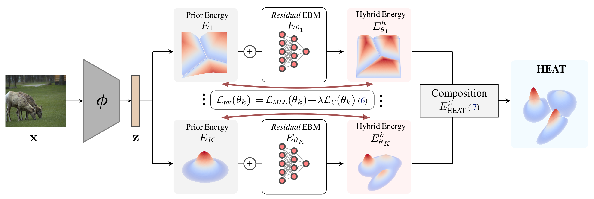

# Hybrid Energy Based Model in the Feature Space for Out-of-Distribution Detection [ICML 2023]
This repo contains the official implementation of the ICML 2023 paper [Hybrid Energy Based Model in the Feature Space for Out-of-Distribution Detection](https://arxiv.org/abs/2305.16966).




# Usage
## Install dependencies
 ```
 python3 -m venv .venv
 source .venv/bin/activate
 pip install -U pip
 pip install -e .
 eval "$(python heat/train_ebm.py -sc install=bash)"
 ```
## CIFAR-10/CIFAR-100 benchmarks:
### Datasets
Create a folder named datasets:
```
mkdir ./datasets
```
All the datasets will be automatically downloaded from `torchvision.datasets` except for LSUN and Tiny-Imagenet-200. 
   - To download the validation set of LSUN:
   
      ```
      python heat/datasets/download_lsun.py -o ./datasets/LSUN -s val
      unzip ./datasets/LSUN/\*.zip -d ./datasets/LSUN
      ```
   
   - To download the tiny-imagenet-200 dataset:
   
      ```
     mkdir datasets/tiny-imagenet-200
     curl http://cs231n.stanford.edu/tiny-imagenet-200.zip -o ./datasets/tiny-imagenet-200/tiny-imagenet-200.zip
     unzip ./datasets/tiny-imagenet-200/tiny-imagenet-200.zip -d ./datasets/
      ```
   
### Backbones
Downlaod the CIFAR-10 and CIFAR-100 resnet34 backbones with the following commands:
   ``` 
   wget https://www.dropbox.com/s/l6d82sp99clbch4/weights.zip?dl=0 -O weights.zip 
   unzip weights.zip
   ```
   
## Imagenet benchmark
### Datasets
 - Download [ImageNet-1k](http://www.image-net.org/challenges/LSVRC/2012/index) and place the training data and validation data in `./datasets/Imagenet/train` and  `./datasets/Imagenet/val`, respectively.
 - For the out-of-distribution datasets we use the curated datasets from the official repository of the paper [Out-of-distribution Detection with Deep Nearest Neighbors](https://github.com/deeplearning-wisc/knn-ood), download the archives from their repo and place it into the `datasets` folder.
   ```
   wget http://pages.cs.wisc.edu/~huangrui/imagenet_ood_dataset/iNaturalist.tar.gz
   wget http://pages.cs.wisc.edu/~huangrui/imagenet_ood_dataset/SUN.tar.gz
   wget http://pages.cs.wisc.edu/~huangrui/imagenet_ood_dataset/Places.tar.gz
   ```
   ```
   tar -xf iNaturalist.tar.gz -C datasets
   tar -xf SUN.tar.gz -C datasets
   tar -xf Places.tar.gz -C datasets
   ```
2. The backbone used in this paper is a resnet50 pre-trained on Imagenet by pytorch (`IMAGENET1K_V1`).
3. Pre-compute Imagenet features with the chosen backbone:

   ```
   python heat/compute_features.py --data_dir datasets/Imagenet/train --out_dir datasets/Imagenet_precompute --model_id imagenet-resnet50-__pretrained__
   ```


# Training the residual EBMs

The training of HEAT consists in training an energy-based residual correction of each selected prior OOD scorers. In the paper we correct the
[Energy Logits](https://arxiv.org/abs/2010.03759) (EL) scorer, the [Gaussin Mixture Model](https://arxiv.org/abs/2103.12051) (GMM, supervised version) scorer and a Gaussian Mixture Model learned on the standard deviation pooling of the volume produce by the feature extractor (GMM-std). 

1. Training on CIFAR-10:
   ```
   python heat/train_ebm.py  dataset=cifar10  transform=cifar10 backbone=resnet34_c10 \
   ebm=heat_gmm_c10 batch_size=1024  n_epochs=20  exp_name=heat_gmm_c10
   ```
   ```
   python heat/train_ebm.py  dataset=cifar10  transform=cifar10 backbone=resnet34_c10 \
   ebm=heat_gmm_std_c10 batch_size=1024  n_epochs=20  exp_name=heat_gmm_std_c10 pooling=std
   ```
   ```
   python heat/train_ebm.py  dataset=cifar10  transform=cifar10 backbone=resnet34_c10 \
   ebm=heat_el_c10 batch_size=256  n_epochs=20  exp_name=heat_el_c10 
   ```
   
2. Training on CIFAR-100:
   ```
   python heat/train_ebm.py  dataset=cifar100  transform=cifar100 backbone=resnet34_c100 \
   ebm=heat_gmm_c100 batch_size=1024  n_epochs=20  exp_name=heat_gmm_c100
   ```
   ```
   python heat/train_ebm.py  dataset=cifar100  transform=cifar100 backbone=resnet34_c100 \
   ebm=heat_gmm_std_c100 batch_size=1024  n_epochs=20  exp_name=heat_gmm_std_c100 pooling=std
   ```
   ```
   python heat/train_ebm.py  dataset=cifar100  transform=cifar100 backbone=resnet34_c100 \
   ebm=heat_el_c100 batch_size=256  n_epochs=8  exp_name=heat_el_c100
   ```
3. Training on Imagenet:

   ```
   Coming soon !
   ```
   
Alternatively you can download the pre-trained residual EBMs :

   ```
   Coming soon !
   ```


# Evaluate

To evalute each individual energy-based corrections and their composition, e.g. on CIFAR-10 run the following command
   ```
   python heat/eval_scorers.py --scorers heat_gmm heat_el_c10 heat_gmm_std_c10 --dir ood_experiments/CIFAR10/resnet34_sup \
   --config_file heat_gmm_c10/.hydra/config.yaml --ckpts heat_gmm_c10/weigths/epoch_20.ckpt \
   heat_el_c10/weigths/epoch_20.ckpt heat_gmm_std_c10/weigths/epoch_20.ckpt
   ```

